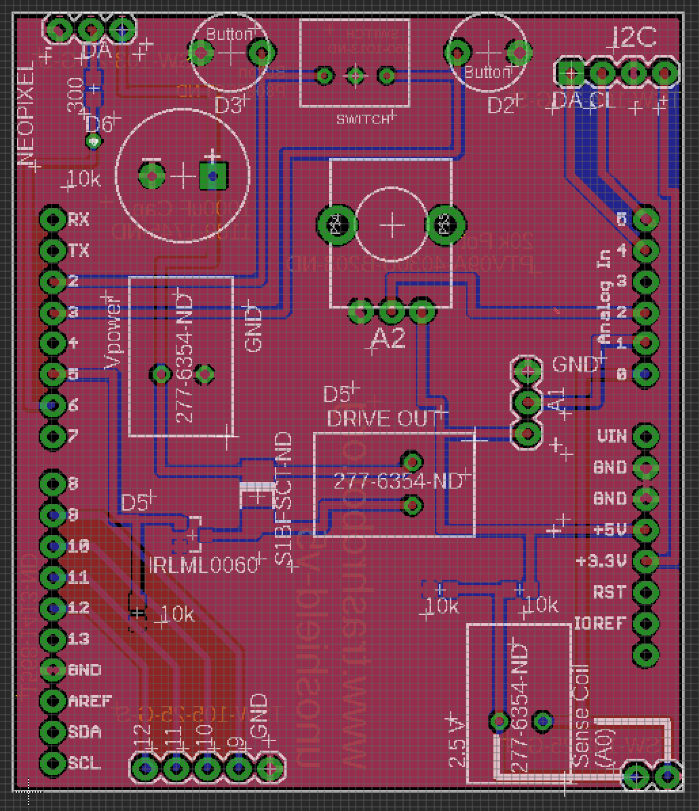

# [Open Arduino](https://github.com/LafeLabs/openarduino)

## Open Source Hardware Development with Arduino

This class is itself a self-replicating open source document.  In the class you learn how to make and share open source documents, including this one.  With the kit you received with this class you can teach your family at home or your friends at school everything in here, using this web document as your own reference when sharing.  Find someone who could benefit from Arduino and pass along what you have learned!  It is all free!

[code server](codeserver/)

## Classes(1 semester, 1 day/week, 12 weeks, 8-12th grade level):

 - [class 1: blink/](class1-blink/)
 - [class 2: blinking-lights-2/](class2-blinking-lights-2/)
 - [class 3: buttons, knobs, serial, digital input/output](class3-buttons-knobs-io/)
 - [class 4: neopixels](class4-neopixels/)
 - [class 5: motors/](class5-motors/)
 - [class 6: accelerometers](class6-sensors/)
 - [class 7: github](class7-github/)
 - [class 8: final projects](class8-finalprojects/)

## Materials:

 - [amazon UNO R3 from Elegoo 10 units $14/ea](https://www.amazon.com/ELEGOO-Board-ATmega328P-ATMEGA16U2-Compliant/dp/B01EWOE0UU/)
 - [amazon 10 count 9v batteries ($7 total for 10):]
(https://www.amazon.com/Super-Heavy-Battery-Remote-Control/dp/B00ZTS55Y4/)
 - [adafruit 10 units, acceleromter $5/ea:](https://www.adafruit.com/product/2809)
 - [adafruit 10 units, 9V battery holder $4/ea:](https://www.adafruit.com/product/67)
 - [16 pixel ring $10:](https://www.adafruit.com/product/1463)
 - [motor driver board dual h brdige $5:](https://www.adafruit.com/product/2448)
 - [2 kits of 6 units of tiny breadboards($15 total for two kits) ](https://www.amazon.com/ELEGOO-6PCS-tie-Points-Breadboard-Arduino/dp/B01EV6SBXQ)

[boards/unoshield-v5.brd](boards/unoshield-v5.brd)

[boards/unoshield-v5.sch](boards/unoshield-v5.sch)

[boards/unoshield-v5-bom.xlsx](boards/unoshield-v5-bom.xlsx)

10 of my shields, from my personal collection, free, and random motors

[digikey shopping cart to stuff shield](https://www.digikey.com/short/92z70jhr)

[buy boards from pcbway.com](https://www.pcbway.com/project/shareproject/Generic_Trash_Robot_UNO_Shield__V5.html)

grab bag:

 - [light sensor(buy 1)](https://www.adafruit.com/product/1980($6.95/ea))
 - [gesture sensor(buy 1):](https://www.adafruit.com/product/3595($7.50/ea))
 - [sonar distance sensors(buy 4):](https://www.adafruit.com/product/3942($4/ea))
 - [8 pixel neopixel linear array(the most basic one)(buy 10)](https://www.adafruit.com/product/1426($5.95/ea))
 - [adafruit 10 units, motor shield $20/ea](https://www.adafruit.com/product/1438)
 - [adafruit 10 units, 1 meter neopixel array, $17/ea](https://www.adafruit.com/product/1376?length=1)
