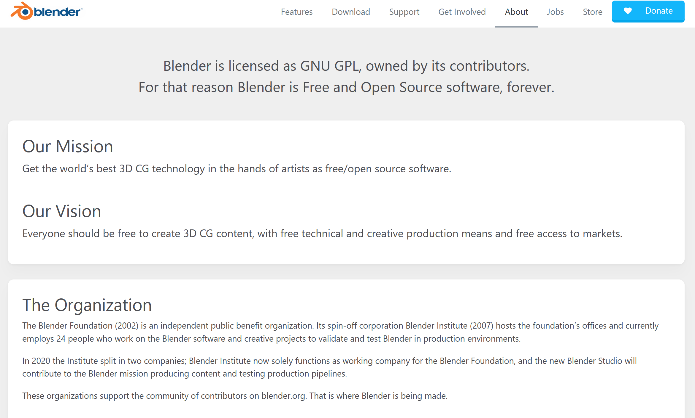
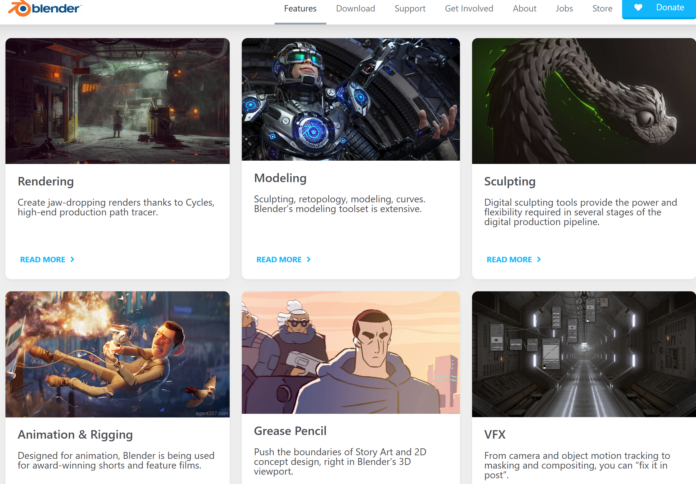
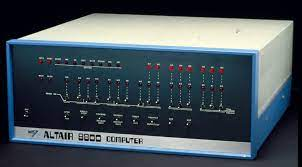
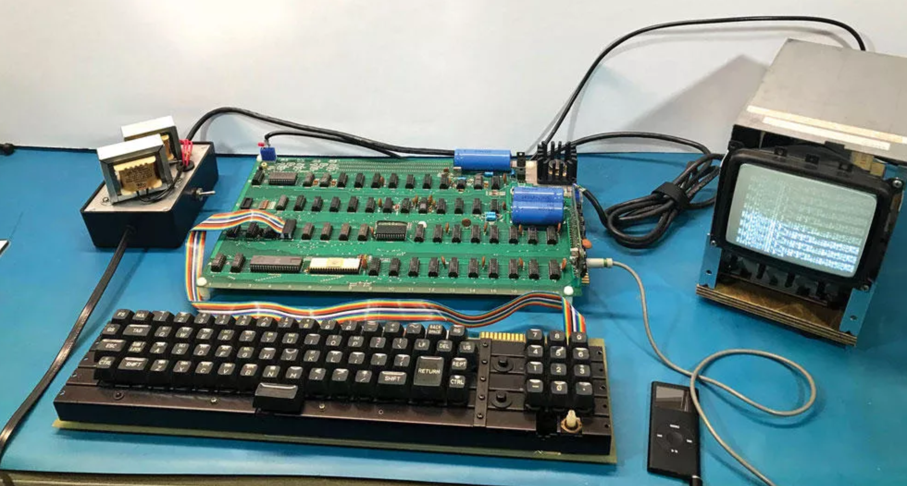
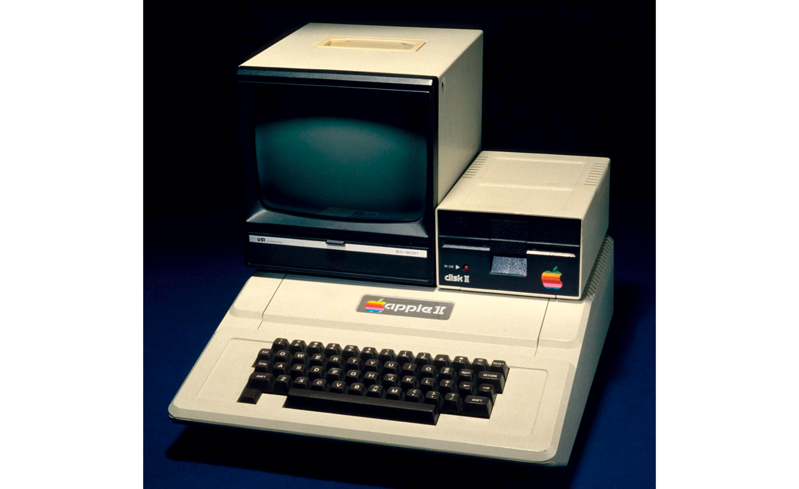
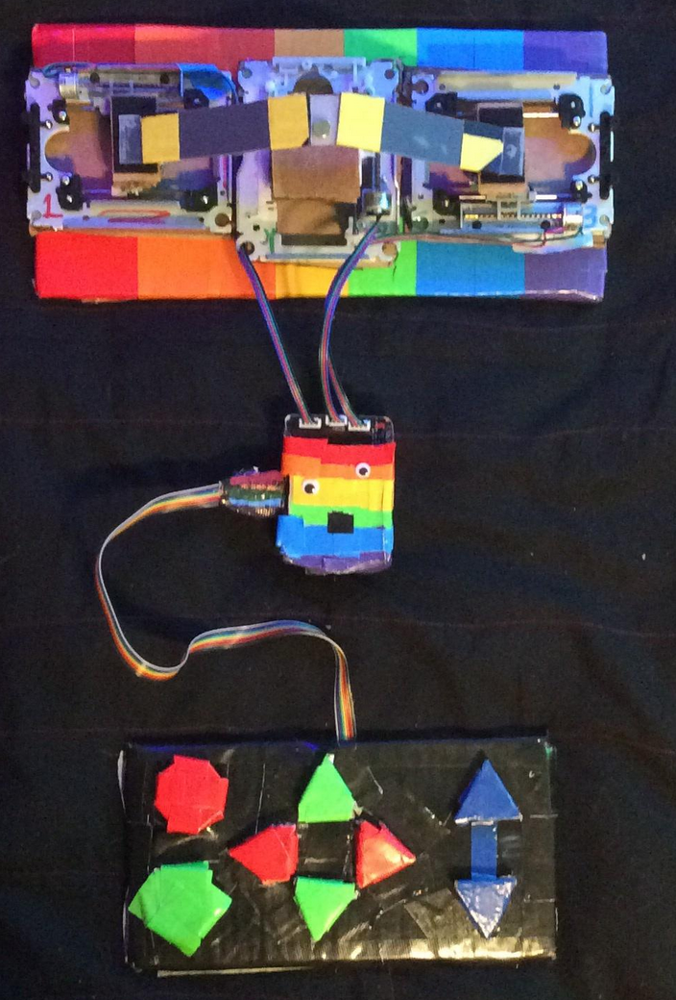
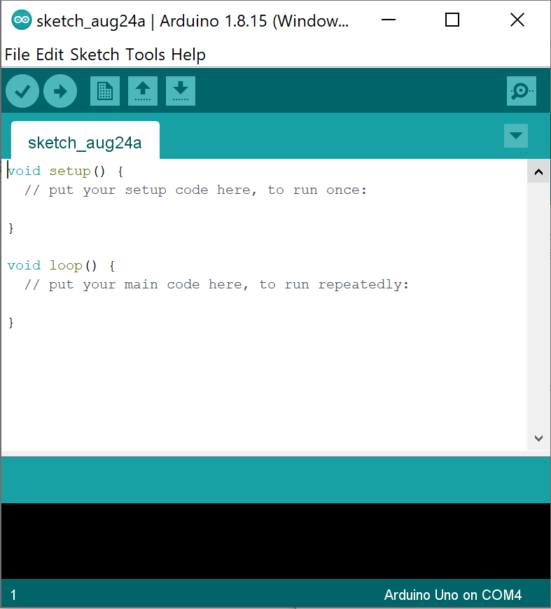
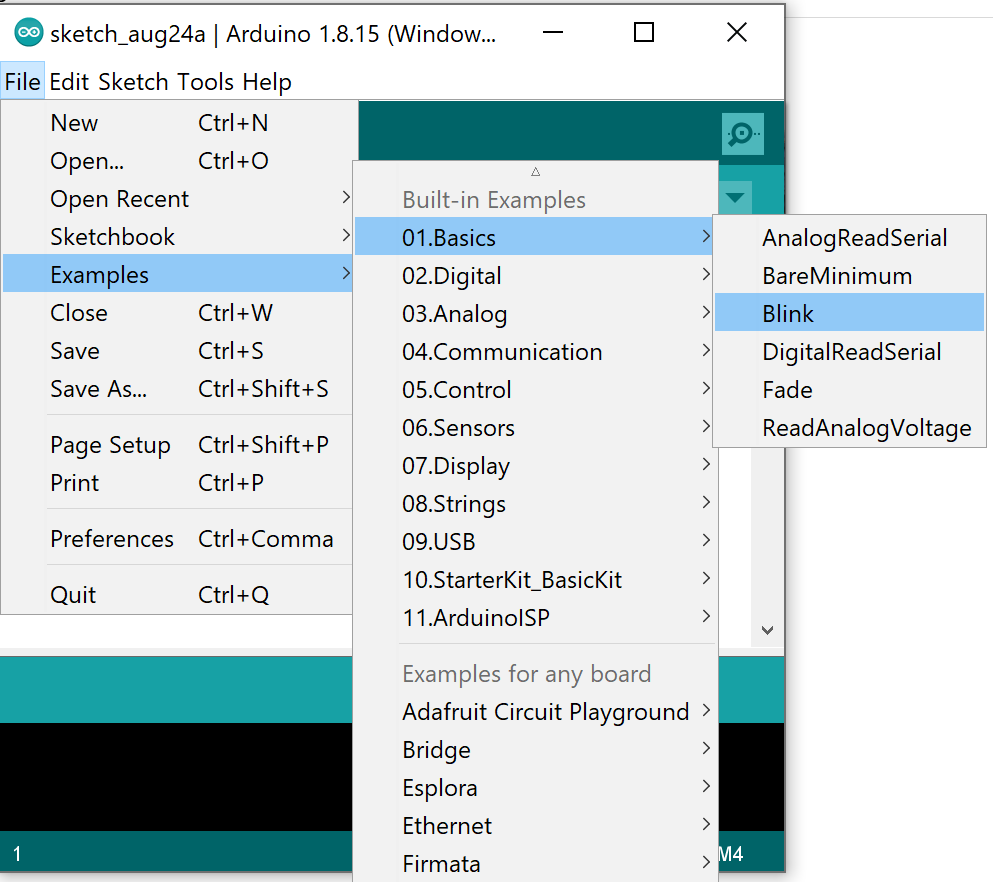
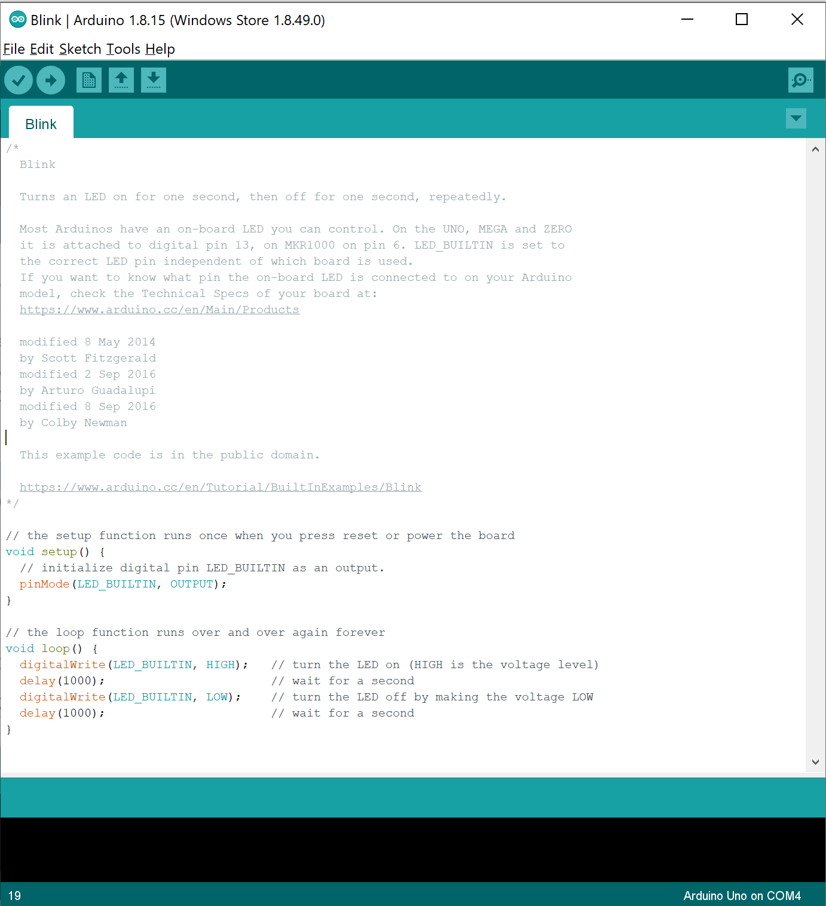
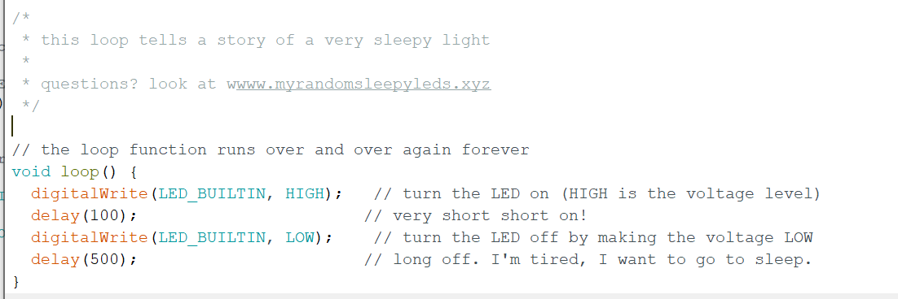

[../](../)

# Class 1: Open Source Blinking Lights

### Goals of Class 1:

 - learn the computer history which led to Arduino
 - learn what open source development means: code is social media
 - learn what Arduino is and get some idea of what it can do
 - download and install Arduino IDE
 - connect Arduino UNO to computer, make sure IDE can see it
 - get LED to blink
 - tell a story with a blinking light and share it
 - run someone else's story and share that(code as social media)

### What is Open Source?

In open source development we treat technology as social media.  That is, when we make a thing, we share the information which generated that thing(code, designs, instructions, descriptions) in the hopes that other people will copy the thing.  

In open source software we make the source code freely available to other software developers who can then instantly copy the files and build their own code on top of it.  

Open hardware is a little bit more complex to replicate. Most useful products are composed of several different kinds of things, such as circuit boards, plastic enclosures, batteries, knobs and buttons.  

Open source software runs the Internet: most of the infrastructure which makes individual apps work is open source software.  Open source software is created for the public good by creators who choose to share freely.  Open source hardware can change the world! If we build things out of simple and easy to use materials and share our methods with other people, we can spread what we build freely to all people!

This class is itself an open source thing: a publicly available web resource at [github.com](https://github.com/LafeLabs/openarduino) has all the components of the class, along with a license granting the entire world the right to use it as they see fit.  In this class I will share with you how I develop open source hardware using the Arduino.  

Open source software is also a movement, with people working for free to create things and share them for the good of all.  

[Blender](https://www.blender.org) is a free open source software package for 3d modelling which is good enough to be used in professional projects.  

### Github: Social media for creators of code

 - [Github.com](https://github.com/) is a company which hosts code repositories.  
 - They are free for open source projects
 - They manage version control of projects which evolve over time and have many contributors
 - They have similar structure to other social media(people follow each other, can message and share)
 - Are built on top [Git](https://git-scm.com/), which is a free and open source version control software, which can work on any computer
 - Github.com is for-profit, provides premium services for closed-source projects, while maintaining free access for open source

###  Personal Computer History
  
It all began with just switches and blinking lights and the ability to program things!  This is what we will start with in this class.

### The Altair 8800

 - [wikipedia page](https://en.wikipedia.org/wiki/Altair_8800)
 - nothing but blinking lights and switches!
 - came as a kit, you had to build from scratch
 - released 1976 a little over $400(a little over $2000 today)
 - sold 5000 units in the first few months!

### Apple I: 

 - [wikipedia entry](https://en.wikipedia.org/wiki/Apple_I)
 - $666.66 in 1976, or about $3000 today
 - total number produced: about 200
 - $20 per board to make, plus $1000 setup cost
 - JUST a circuit board! 
 - needed a keyboard, television, tape deck and power supply to run
 - user had to assemble whole system
 - clever(this board's layout and software was the core invention of Steve Wozniak on which Apple was built)
 - did not have significant impact on society

## Apple II.

What is the difference from the Apple I?  Essentially building a box, and putting a bunch of existing things together(drives, screens, keyboards, power supplies).  The core technology/invention was the same for these two products and yet just adding a box and putting some things together was a billion dollar product that changed the world. 

The lesson? The hard thing about technology is not engineering, but how our *use* of technology connects with other humans.  

## Arduino UNO

 - Control blinking lights
 - Add "shields" to do more complex tasks
 - Connects to all platforms(windows, Apple, Linux) via standard printer cable
 - Circuit diagram, layout, part lists, and all the code are freely available to copy
 - Combined for profit and non profit model
 - Named after the bar where founders spent time, in Italy(social technology creation!)
 - Can form the basis of commercial products, with a smooth transition from very low cost prototyping to a final product which can be produced at scale

## What can we do with the Arduino?

 - Sense proximity
 - Sense motion
 - Sense magnetic fields
 - Detect sound
 - Create sound
 - Control blinking lights(our main concern here!)
 - Be controlled with buttons and knobs
 - Control motors and valves
 - Plot output of any physical measurement in real time on a computer
 - Build your own "internet of things" devices
 - Build agricultural automation systems(control water valves, lights, robotic harvesters)
 - Build art projects which integrate physical and digital media
 - Learn and teach code in a practical way

### What do I do with Arduino?

I use Arduino to build things out of trash which I hope to get people to copy.  I believe everything we build should be built from trash, and that the easier it is to make create new technologies, the more likely it is for this kind of thing to take off. So Arduino plays a huge role in the work I do.

[Trash Robot](https://www.trashrobot.org):

 - An open source robot built from the Arduino and trash, which prints art in clay.
 - Costs about $40 to $50 to build
 - Free open source software allows people to create their own symbol programs for the robot and share them with other people across the world
 - The documents describing in detail how to build it and program it are integrated into a self-replicating documentation system

### First Step: Plug in the Arduino, Load the IDE
 

### Second Step: Blinking Light!

### Exercise: Social coding!

Tell a story using Arduino code, share it with others, load someone else's story onto your Arduino and share that story.

### Morse Code:

[US navy light signalling in 2017 using texting](https://newatlas.com/us-navy-signal-lamps-fltc-texting/50523/)

[morse code wikipedia](https://en.wikipedia.org/wiki/Morse_code)

   - dot: one time unit long
   - dash: three time units long
   - inter-element gap between the dits and dahs within a character: one dot duration or one unit long
   - short gap (between letters): three time units long
   - medium gap (between words): seven time units long

