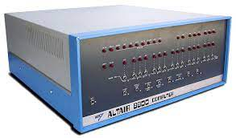

# Class 1: Open Source Blinking Lights

### Goals of Class 1:

 - learn the computer history which led to Arduino
 - learn what open source development means: code is social media
 - learn what Arduino is and get some idea of what it can do
 - download and install Arduino IDE
 - connect Arduino UNO to computer, make sure IDE can see it
 - get LED to blink
 - tell a story with a blinking light and share it
 - run someone else's story and share that(code as social media)

### What is Open Source?

In open source development we treat technology as social media.  That is, when we make a thing, we share the information which generated that thing(code, designs, instructions, descriptions) in the hopes that other people will copy the thing.  

In open source software we make the source code freely available to other software developers who can then instantly copy the files and build their own code on top of it.  

Open hardware is a little bit more complex to replicate. Most useful products are composed of several different kinds of things, such as circuit boards, plastic enclosures, batteries, knobs and buttons.  

### The Altair 8800

 - [wikipedia page](https://en.wikipedia.org/wiki/Altair_8800)
 - nothing but blinking lights and switches!
 - came as a kit, you had to build from scratch
 - released 1976 a little over $400(a little over $2000 today)
 - sold 5000 units in the first few months!

### Apple I: 

 - [wikipedia entry](https://en.wikipedia.org/wiki/Apple_I)
 - $666.66 in 1976, or about $3000 today
 - total number produced: about 200
 - $20 per board to make, plus $1000 setup cost
 - JUST a circuit board! 
 - needed a keyboard, television, tape deck and power supply to run
 - user had to assemble whole system
 - clever(this board's layout and software was the core invention of Steve Wozniak on which Apple was built)
 - did not have significant impact on society

## Apple II.

What is the difference from the Apple I?  Essentially building a box, and putting a bunch of existing things together(drives, screens, keyboards, power supplies).  The core technology/invention was the same for these two products and yet just adding a box and putting some things together was a billion dollar product that changed the world. 

The lesson? The hard thing about technology is not engineering, but how our *use* of technology connects with other humans.  

[US navy light signalling in 2017 using texting](https://newatlas.com/us-navy-signal-lamps-fltc-texting/50523/)

[morse code wikipedia](https://en.wikipedia.org/wiki/Morse_code)

   - dot: one time unit long
   - dash: three time units long
   - inter-element gap between the dits and dahs within a character: one dot duration or one unit long
   - short gap (between letters): three time units long
   - medium gap (between words): seven time units long

[https://raw.githubusercontent.com/LafeLabs/thing/master/minimal/github/php/replicator.txt](https://raw.githubusercontent.com/LafeLabs/thing/master/minimal/github/php/replicator.txt)
