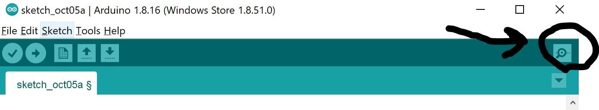
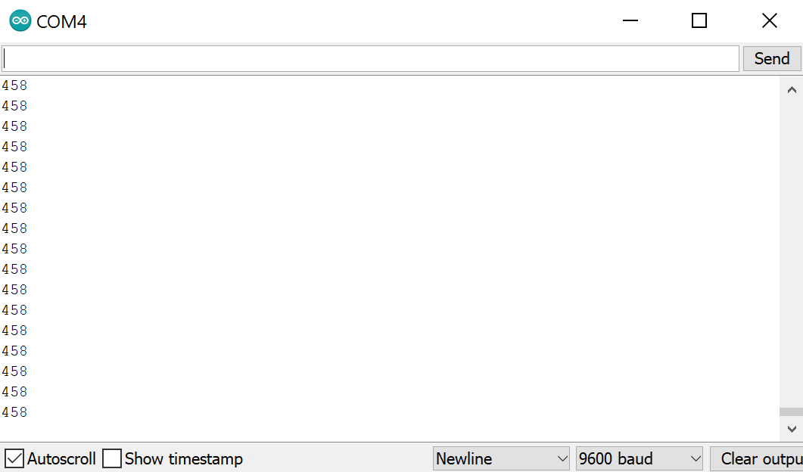
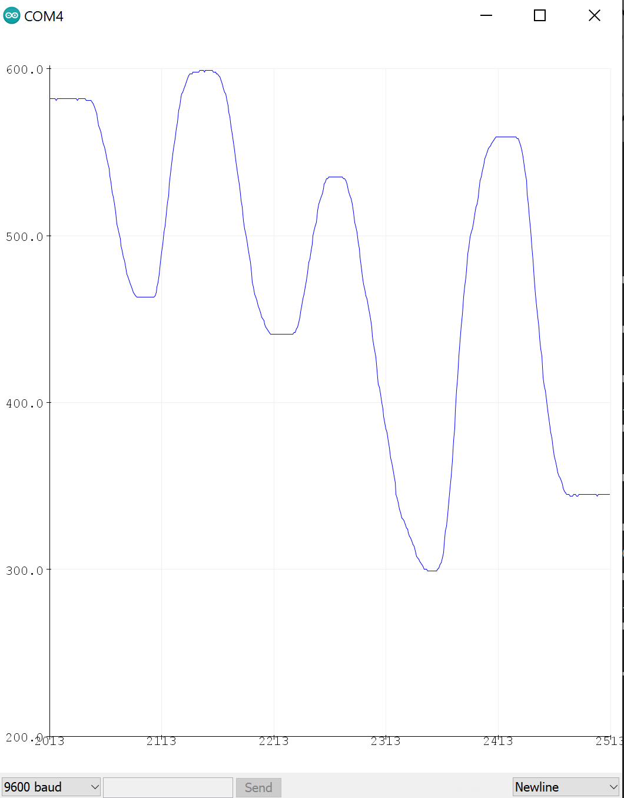

[../](../)

[codeserver/](codeserver/)

#  Class 3: buttons, knobs, digital IO

Goals: 

1. Learn to use analog inputs for knobs
2. learn to use digital inputs for buttons
3. learn to use Serial monitor and plot to see analog signals(knob)
4. put it all together with a turn signal
5. if there is time, social coding with digital output/input connecting pairs of Arduinos to make simple games

Things to learn:

1. digital logic: "not", "and", if/then
2. input modes: INPUT, OUTPUT, INPUT_PULLUP, analog
3. Serial.begin([baud rate]), Serial.println(), Serial.print()

## Introduction to shields

You have a shield with this class.  A "shield" is a term for a custom circuit board which plugs into the standard Arduino pin sockets.  This is the heart of the power of the open source platform: by making this open standard we can all plug into, Arduino empowers us to design and build our own shields for any purpose.  Once that shield exists, we just plug it into the Arduino and add whatever we designed into the board.  This shield is designed and made by me specifically for Arduino teaching, and has some random useful things we'll see in the coming weeks.  Plug it in.

## Analog input.  

Labeled as names: A0 through A5.  Measures the voltage on the pin as a number between 0 and 1023, where 0 is 0 volts and 1023 is the power supply voltage of 5 V.

Read from an analog pin with the command

```
analogRead([pin name])
```
The connection between your computer and the Arduino is over a serial line via USB. You can read characters sent down this line by the Arduino by programming the Arduino to print characters, and using built in monitoring tools in the Arduino IDE to see the response.

If you want to use the Serial functions on the Arduino you want to start a serial stream with the command

```
Serial.begin([baud rate])
```

And the baud rate is a standard rate for data transmission such as 9600 or 115200(two of the most common choices.)  While there are other choices, in this class we will set speed to 9600 if we don't care about speed and if we're looking to get data faster to 115200.

Once a serial port is being used by the Arduino, we can send characters down the line with `Serial.print()` and `Serial.println()`.  `print()` refers to just a character without a new line, and `println()` refers to printing with a newline.  

To see how the knob works, plug the Arduino shield onto the UNO, and upload the following code to the board:

[link to knob.ino code](codeserver/code/knob.ino) 

```
int knob = 0;

void setup() {

    Serial.begin(9600);

}

void loop() {

  knob = analogRead(A2);
  Serial.println(knob); 

}
```

With that uploaded, open the Serial monitor.  Make sure the monitor is set to the same baud rate, of 9600.  Turn the knob.  You should see a response in the numbers from 0 to 1023.  That knob is a "potentiometer", or variable resistor, which has the two ends connected to 0 volts(ground) and 5 volts(Vcc) and which has a center pin which varies from all the way connected to one end to the other, continuously.

Now look at the text from the serial port by clicking on the link for the serial monitor in the upper right corner of the IDE:



The serial monitor should look like this:



Turn the knob. See the numbers change.

Now close the serial monitor(this is an important step!) and find the serial plotter from the tools menu and open that.  Now you should be able to see a graph of the value of the knob over time.  Turn the knob and make curves!




## Buttons


Now that you know about knobs, analog reading of voltages, and serial, we will move on to buttons.  The buttons we are using have two pins, which are disconnected normally.  When you press the button down and it clicks, the pins become electrically connected. When you stop pushing it becomes disconnected again.  In the circuit on your shields, the two buttons connect pin 2 to ground and pin 3 to ground.  They are labelled incorrectly, and D2 is 3 and vice versa(sorry!).

Now upload the basic button code:

[link to buttons.ino code](codeserver/code/buttons.ino)

```

int button1pin = 3;
int button2pin = 2;

boolean button1 = false;
boolean button2 = false;

void setup() {
    pinMode(button1pin,INPUT_PULLUP); 
    pinMode(button2pin,INPUT_PULLUP); 

    Serial.begin(9600);

}

void loop() {

  button1 = !digitalRead(button1pin);  
  button2 = !digitalRead(button2pin);  

  Serial.print("button1 = ");
  Serial.print(button1);
  Serial.print(", button2 = ");
  Serial.println(button2); 

}
```

Notice in this code that we set digital input pins not as `INPUT` but as `INPUT_PULLUP`. This makes sure that if the button is not connected that the voltage is "tied" high in that there is an internal resistor to the 5 volt power supply which is a high enough resistance that a low resistance connection to ground will still work but low enough that the voltage won't just drift.

Any input pin in electronics has to have some kind of connection to *something* or it will just start to drift randomly.  Our bodies are badly connected to the world electrically which is why we pick up huge voltages just walking around which can shock us.  This is why when we do work on delicate electronics we will wear a metal ground strap.  Any voltage in a circuit which is not controlled can be a liability.

With this basic code in place, be sure to close the serial plotter and open the serial monitor again. Press the buttons.  You can see how they work.

Also, this is where we must be sure to understand some logic operations. The exclamation mark is a logical "not".  This means that when we read the state of the input voltage, when it's 0, we want to invert that to make it read true, and to make a 5 volt value read as false.  Logical states which are TRUE or FALSE or 1 or 0 use the data type `boolean`.  

Now that we know what a button is, we can make a button controlled dimmer switch with the following code:

[link to buttondimmer.ino code](codeserver/code/buttondimmer.ino)

```
int button1pin = 3;
int button2pin = 2;

boolean button1 = false;
boolean button2 = false;

int x = 0;

void setup() {
    pinMode(button1pin,INPUT_PULLUP); 
    pinMode(button2pin,INPUT_PULLUP); 
    Serial.begin(9600);

}

void loop() {

  button1 = !digitalRead(button1pin);  
  button2 = !digitalRead(button2pin);  

  if(button1){
    x += 1;
  }
  if(button2){
    x -= 1;
  }

  Serial.println(x); 

}
```

Now try graphing the serial output again, and pushing the buttons.  Again, this is starting to have some game-like properties!  Keep this in mind as we move our project ideas!

## Turn Signal with Knob

Now we will put this all together and build the turn signal.  First put your dual LED contraption together as shown in the image, so that one LED goes to pin 7, one to pin 8, and that the ground is connected.  


Now upload the turn signal code:

[link to turn signal code turnsignal.ino](codeserver/code/turnsignal.ino)

```

int knob = 0;
int blinktime = 0;

int button1pin = 3;
int button2pin = 2;
int redled = 10;
int greenled = 11;

boolean button1 = false;
boolean button2 = false;

void setup() {
    pinMode(button1pin,INPUT_PULLUP); 
    pinMode(button2pin,INPUT_PULLUP); 
    pinMode(redled,OUTPUT);
    pinMode(greenled,OUTPUT);
    digitalWrite(redled,LOW);
    digitalWrite(greenled,LOW);
    knob = analogRead(A2);
    Serial.begin(9600);

}

void loop() {

  button1 = digitalRead(button1pin);  
  button2 = digitalRead(button2pin);  
  knob = analogRead(A2);
  blinktime = knob;
  if(!button1 && button2){
    digitalWrite(redled,HIGH);
    delay(blinktime);
    digitalWrite(redled,LOW);
    delay(blinktime);    
    Serial.println("button 1");
  }  
  if(!button2 && button1){
    digitalWrite(greenled,HIGH);
    delay(blinktime);
    digitalWrite(greenled,LOW);
    delay(blinktime);    
    Serial.println("button 2");
  }
  if(button2 && button1){
    digitalWrite(greenled,LOW);
    digitalWrite(redled,LOW);
  }
  if(!button2 && !button1){
    digitalWrite(greenled,LOW);
    digitalWrite(redled,LOW);
  }

  Serial.println(knob); 

}
```

The knob sets the speed, buttons activate turn signal.  Switch might work! give it a try.

## Communication Game

Now we will experiment with connecting Arduinos to each other. Since any pin can be either a digital output or input, we can connect two Arduinos directly, with the output of one going to the other and vice versa.  See the pictures for how to connect using the provided jumpers(which have pins on one end and sockets on the other).


[communication game code](codeserver/code/comms.ino)

```

/* button signal game with two arduinos
 * 
 * look for trigger input or button. on button, do a thing and put out trigger signal
 * 
 * on button do a different thing and put out trigger signal
 * 
 */


int button1pin = 2;
int redled = 7;
int greenled = 8;
int outpin = 9;
int inpin = 3;

boolean button1 = false;
boolean trigger = false;

void setup() {

    pinMode(button1pin,INPUT_PULLUP); 
    pinMode(inpin,INPUT_PULLUP);
    
    pinMode(redled,OUTPUT);
    pinMode(greenled,OUTPUT);
    
    pinMode(outpin,OUTPUT);

    digitalWrite(outpin,HIGH);//simulate button behavior by being high until trigger, which goes low
    digitalWrite(redled,LOW);
    digitalWrite(greenled,LOW);


    Serial.begin(9600);

}

void loop() {

  button1 = !digitalRead(button1pin);  
  trigger = !digitalRead(inpin);

  if(button1){    
    Serial.println("button");
    buttonEvent();
    triggerOutput();
  }  
  if(trigger){
    Serial.println("trigger");  
    triggerEvent();
    triggerOutput();
  }
  
}


void buttonEvent(){

    digitalWrite(greenled,HIGH);
    delay(500);
    digitalWrite(greenled,LOW);
    delay(500);    
    digitalWrite(greenled,HIGH);
    delay(500);
    digitalWrite(greenled,LOW);
    delay(500);    
    digitalWrite(greenled,HIGH);
    delay(500);
    digitalWrite(greenled,LOW);
    delay(500);    
   
 
}

void triggerEvent(){
        
    digitalWrite(redled,HIGH);
    delay(200);
    digitalWrite(redled,LOW);
    delay(200);    
    digitalWrite(redled,HIGH);
    delay(200);
    digitalWrite(redled,LOW);
    delay(200);    

}

void triggerOutput(){
    
    //trigger output:
    digitalWrite(outpin,LOW);
    delay(500);
    digitalWrite(outpin,HIGH);

}

```


