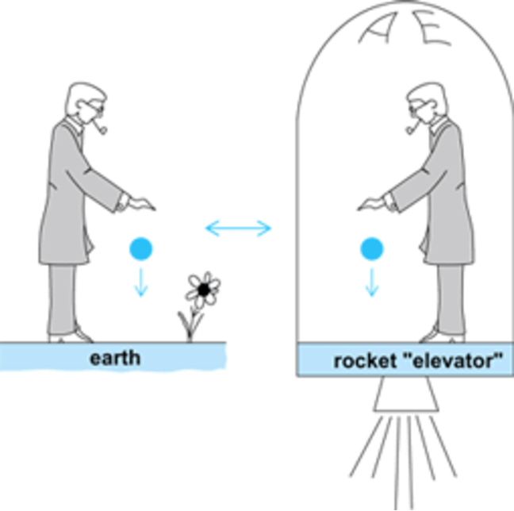
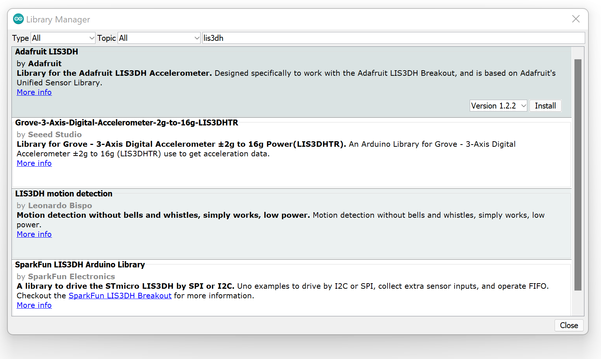
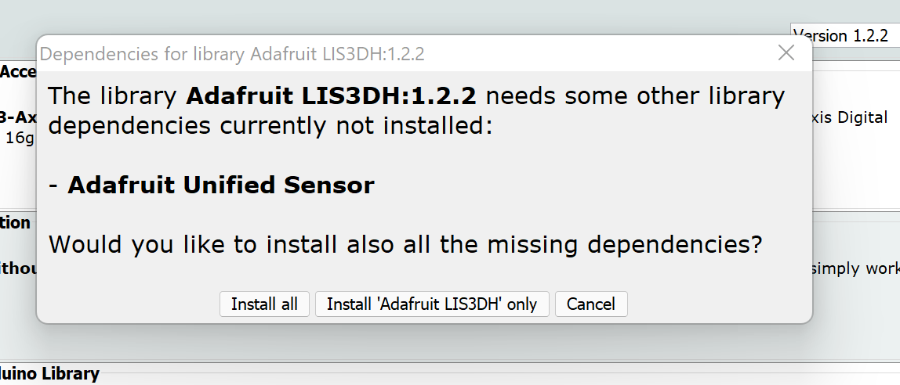
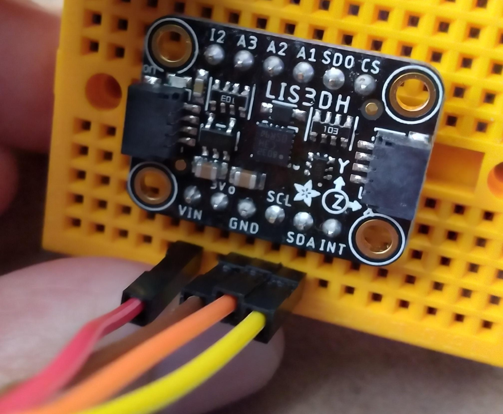
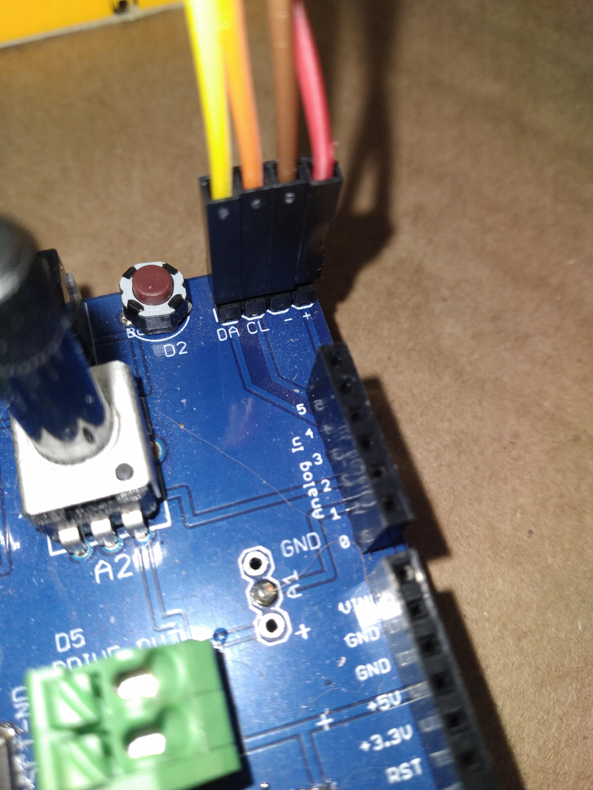
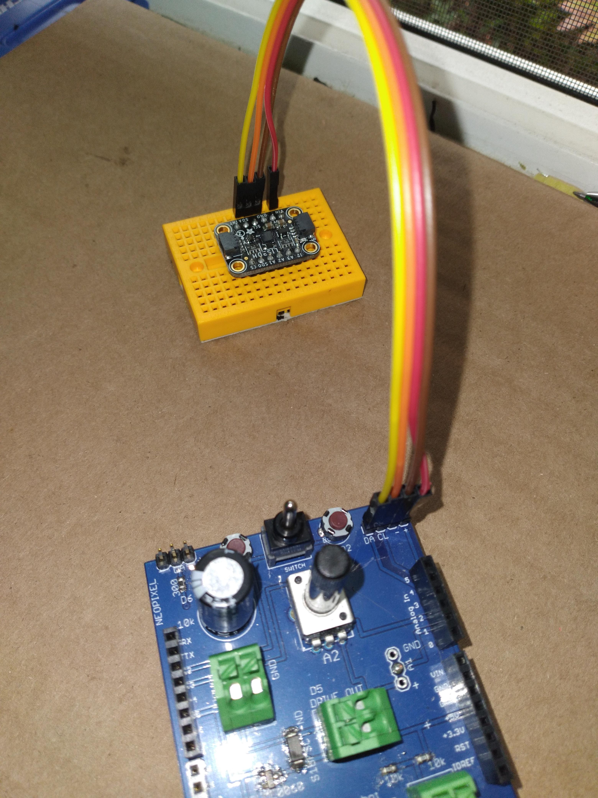
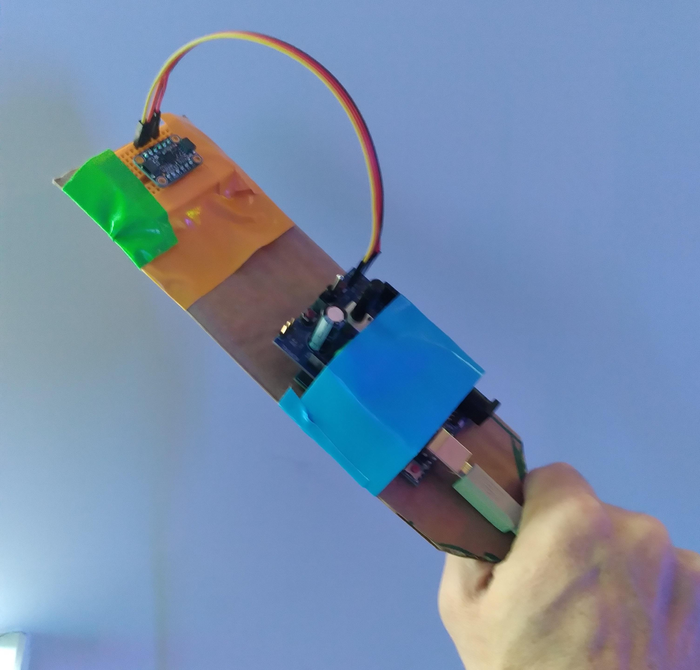

## [../](../)

# Sensors: Acceleromters


We will learn to read out from the Adafruit accelerometer, and then learn to do things with the data, to respond to motions. 

What is an accelerometer?

Accelerometers measure acceleration.  Acceleration can be from moving, where velocity is increasing, decreasing or changing direction, or it can be from the constant effective acceleration of gravity.




[link to adafruit page about product](https://www.adafruit.com/product/2809)

First install the library for the LIS3DH, go to tools then libraries, and search for the sensor name, then click on the Adafruit library and agree to install all the various dependent libraries.






This is a chip which uses the [I2C protocol(wikipedia link)](https://en.wikipedia.org/wiki/I%C2%B2C).  This has four connections: power, ground, clock and data.  

We want to take power from the 5 volt output on the Arduino and connect it to Vin on the board.  SDA is data, SCL is clock.  Be careful and make sure all the pins are right!

Connect from the shield board to the sensor using jumpers as shown:





Then duct tape it to a cardboard board or similar stick-like object to have an object to wave around.



Then open the example program acceldemo and upload it, and look at the sensor data over hte serial.


Now we want to plot the data.  To do that, we'll strip out a bunch of the example and just send down the serial the three values, separated by commas:

```

// Basic demo for accelerometer readings from Adafruit LIS3DH

#include <Wire.h>
#include <SPI.h>
#include <Adafruit_LIS3DH.h>
#include <Adafruit_Sensor.h>

// Used for software SPI
#define LIS3DH_CLK 13
#define LIS3DH_MISO 12
#define LIS3DH_MOSI 11
// Used for hardware & software SPI
#define LIS3DH_CS 10

// software SPI
//Adafruit_LIS3DH lis = Adafruit_LIS3DH(LIS3DH_CS, LIS3DH_MOSI, LIS3DH_MISO, LIS3DH_CLK);
// hardware SPI
//Adafruit_LIS3DH lis = Adafruit_LIS3DH(LIS3DH_CS);
// I2C
Adafruit_LIS3DH lis = Adafruit_LIS3DH();

void setup(void) {
  Serial.begin(115200);
  while (!Serial) delay(10);     // will pause Zero, Leonardo, etc until serial console opens

  //Serial.println("LIS3DH test!");

  if (! lis.begin(0x18)) {   // change this to 0x19 for alternative i2c address
    Serial.println("Couldnt start");
    while (1) yield();
  }


}

void loop() {
  lis.read();      // get X Y and Z data at once
  sensors_event_t event;
  lis.getEvent(&event);
  /* Display the results (acceleration is measured in m/s^2) */
  Serial.print(event.acceleration.x);
  Serial.print(",");Serial.print(event.acceleration.y);
  Serial.print(","); Serial.println(event.acceleration.z);
  
}


```

This is what we will work with in this class.  This is enough to build an incredible complexity of responses.  Everything we do here will be over serial, building responses to this information.


Once again, this class is a collaborative process. Form teams as is convenient, work together, figure out how to detect something meaningful.  

Goal: swish-flick. This is how you levitate things in Harry Potter.  Can we quantify a "swish" and a "flick"?  How do we detect it?  Possible demo: working levitation wand, with a motor controller which turns a winch which hoists an object.  


